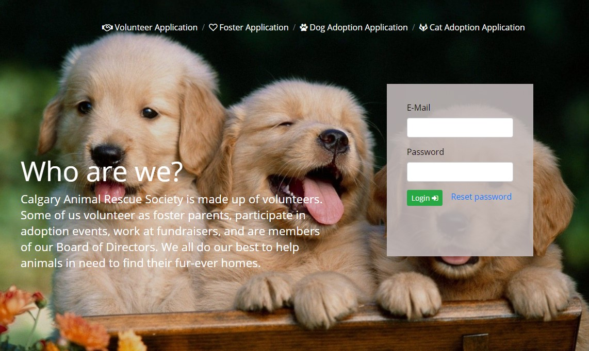

                                              C.A.R.S. Volunteer System

The purpose of this system is to look for volunteers who can become foster parents, participate in adoption events, and work at fundraisers. The system would help both clients and users have better experience when dealing with application forms, managing volunteers, animals and events easily.

The system is used to manage adoption forms, foster/volunteer application forms, and events. CARS Chairs are admins for the system and manage the forms, the personnel and the events. They can view forms and either accept or reject them. They can manage fosters and volunteers that belong to CARS. They can also create and manage events for the organization. 

Fosters and volunteers of CARS have access to their account details and are able to edit them as well as view events that the chairs have created and register/unregister from them. This system ensures that all the essential services that are currently used at CARS are concentrated into one place instead of being scattered across multiple applications. 

# CarsMasterFrontend

This project was generated with [Angular CLI](https://github.com/angular/angular-cli) version 8.3.23.

## Development server

Run `ng serve` for a dev server. Navigate to `http://localhost:4200/`. The app will automatically reload if you change any of the source files.

## Code scaffolding

Run `ng generate component component-name` to generate a new component. You can also use `ng generate directive|pipe|service|class|guard|interface|enum|module`.

## Build

Run `ng build` to build the project. The build artifacts will be stored in the `dist/` directory. Use the `--prod` flag for a production build.

## Running unit tests

Run `ng test` to execute the unit tests via [Karma](https://karma-runner.github.io).

## Running end-to-end tests

Run `ng e2e` to execute the end-to-end tests via [Protractor](http://www.protractortest.org/).

## Further help

To get more help on the Angular CLI use `ng help` or go check out the [Angular CLI README](https://github.com/angular/angular-cli/blob/master/README.md).
